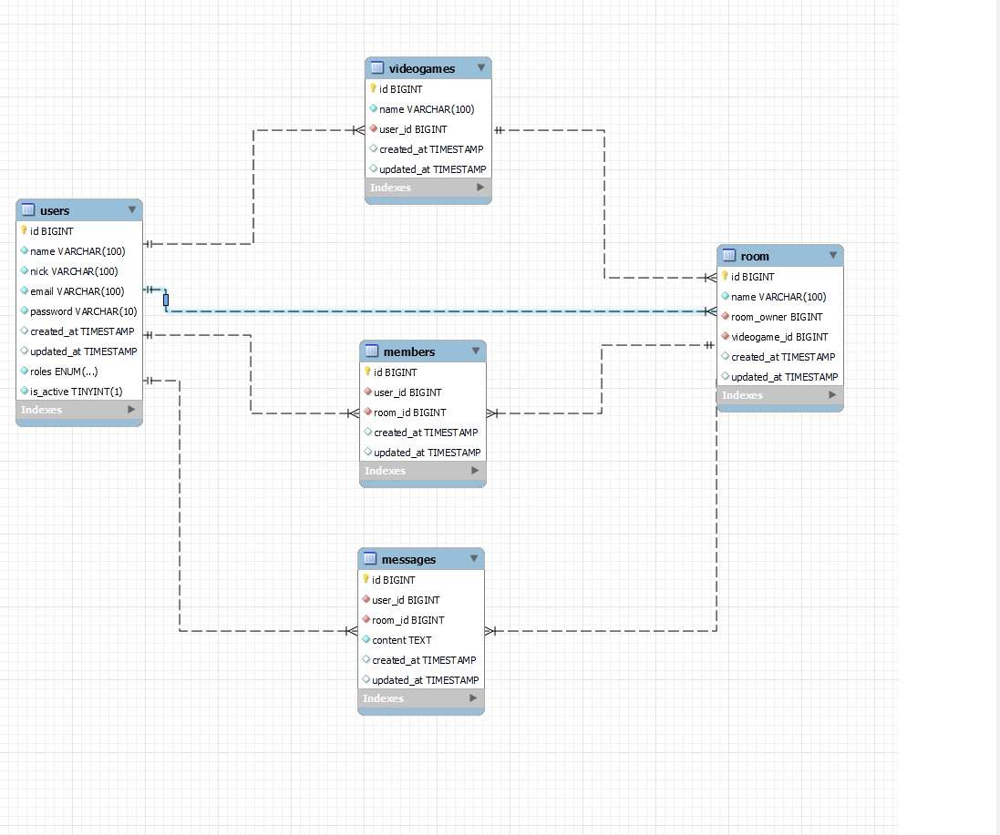

# 🎮 Game Room API 🎮

Welcome to the GameRoom documentation. This API manages user authentication, game rooms and chat between users . It's the 6th project of the GeeksHub Academy Fullstack Bootcamp, showcasing real-world backend development skills with PHP Laravel and SQL databases.

## Table of Contents 🗂️

-   [Features ✨](#features-)
-   [Live Deployment 📡](#live-deployment-)
-   [Installation 🚀](#installation-)
-   [Running directly with composer php artisan](#running-directly-with-composer-php-artisan)
-   [Database Design 📖](#database-design-)
-   [API Endpoints 🔌](#api-endpoints-)
-   [Authors ✒️](#authors-)
-   [Acknowledgements 🎓](#acknowledgements-)

## Stack 🛠️

[](https://www.php.net/manual/es/intro-whatis.php)[](https://www.mysql.com/)[](https://laravel.com/)[](https://stackoverflow.com/)[](https://code.visualstudio.com/)[](https://git-scm.com/)[](https://github.com/)[](https://www.thunderclient.com/)[](https://www.postman.com/)

## Features ✨

-   **User Authentication:**
-   **Room creation:**
-   **Chat in real time:**
-   **Admin CRUD Endpoints:**
-   **MySQL Database with Laravel and Migrations:**
-   **Seeder Data Generation:**
-   **Error Handling:**

## Installation 🚀

Get a copy of the project up and running on your local machine for development and testing purposes.

```sh
git clone https://github.com/PascuFCalvo/GameRoomGeeks.git
cd GameRoomGeeks
```

You'll need add a `.env` based on the provided `.env.example` file with the database credentials, and have a MySQL server running.

#### Running directly with composer php artisan

```sh
composer install
php artisan serve
php artisan migrate
php artisan db:seed
```

## Database Design 📖



<details>
  <summary style="font-weight: bold; font-size: 1.3em;">Endpoints</summary>

-   `Route::post('/register')` Register users.
-   `Route::post('/login')` Login in the app.
-   `Route::post('/logout')` Logout from the app.
-   `Route::post('/videogame')` Put a new videogame on the database.
-   `Route::put('/videogame/{id}')`Edit the data of a videogame.
-   `Route::delete('/videogame/{id}')`Delete a videogame from the database.
-   `Route::get('/videogame/{id}')`Get an especific videogame.
-   `Route::get('/videogames')`Get a list of all videogames.
-   `Route::get('/profile')`Show your user profile.
-   `Route::put('/users/inactivate')`Inactivate a user.
-   `Route::put('/users/activate/{id}')`Activate a user as a superadmin.
-   `Route::put('/users')`Get a list of all users.
-   `Route::put('/users/password')`Change your user password.
-   `Route::post('/rooms')`Create a new game room.
-   `Route::get('/rooms')`Get a list of all game rooms.
-   `Route::get('/rooms/{id}')`Get an especific room.
-   `Route::delete('/rooms/{id}')`Delete an especific room.
-   `Route::put('/rooms/{id}')`Edit the data of a room.
-   `Route::post('/member')`Create a new member to enter in a room.
-   `Route::get('/members')`Get a list of all the members.
-   `Route::delete('/member')`Delete a member.
-   `Route::post('/messages')`Create a message.
-   `Route::get('/messages/{id}')`Get a list of all messages in an especific room.
-   `Route::delete('/messages/{id}')`Delete a message.
-   `Route::put('/message/{id}')`Edit a message.
-   `Route::get('/allMessages')`Get all messages as a superadmin.

</details>

## Authors✒️

-   **Noelia Marcos** - **Vanessa Brito** - **Pascual Fernandez**
    -   [GitHub Noelia](https://github.com/Noeliamll) - [GitHub Vanessa](https://github.com/vanbrigo) - [GitHub Pascual](https://github.com/PascuFCalvo)

## Roadmap 🛣️

-   **Add notifications** - So users know when receive a new message in their groups.
-   **Add a React frontend** - So users can interact with the API from a web browser.

## Acknowledgements 🎓

-   A big shoutout to the **Geekshubs Academy** and to my project partners for the opportunity to learn and grow as a developer.
